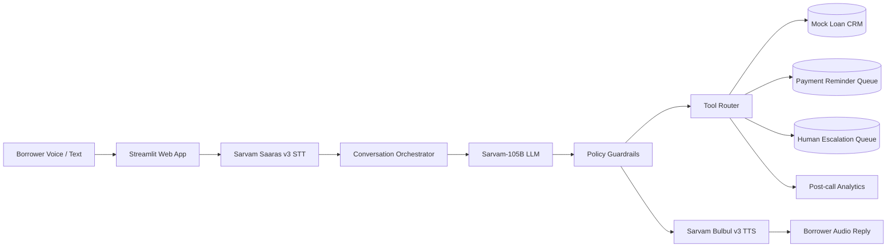

# Sarvam AI Pre-Sales Assignment
## Use Case: Multilingual Loan Collections & Recovery Agent

This repository contains a working proof-of-concept for an enterprise collections voice agent for NBFCs and banks in India.

The demo shows how Sarvam AI can automate early-stage EMI reminder and recovery calls in Indian languages, capture borrower intent, negotiate compliant next steps, and update downstream systems.

## Demo Story

A borrower has missed an EMI. The agent calls or chats with the borrower in Hindi, English, or Hinglish.

The agent can:

- remind the borrower about overdue EMI
- understand payment objections
- offer compliant options such as promise-to-pay, partial payment, or callback
- escalate financial distress, dispute, harassment, or legal-risk cases
- update a mock CRM after the conversation
- generate a post-call summary, risk score, and next-best action

## Sarvam APIs Used

| Sarvam API | Role in Solution |
|---|---|
| Saaras v3 Speech-to-Text | Converts borrower voice into text across Indian languages and code-mixed speech |
| Sarvam-105B Chat Completions | Drives compliant collections conversation, objection handling, summarisation, and workflow decisions |
| Bulbul v3 Text-to-Speech | Converts agent response into natural Indian-language speech |
| Sarvam Translate / Mayura | Optional fallback for translating summaries or CRM notes |

The app has a safe `MOCK_MODE=true` default so reviewers can run it without exposing API keys. Set `MOCK_MODE=false` and add a Sarvam API key to call live APIs.

## Architecture



## Repository Structure

```text
README.md
src/
  app.py                  # Streamlit demo app
  sarvam_client.py        # Sarvam API wrapper with mock fallback
  workflow.py             # Agentic workflow and CRM update logic
  policies.py             # Collections compliance guardrails
  schemas.py              # Data models
  mock_crm.py             # Mock borrower/account records
  requirements.txt
  .env.example
data/
  borrower_accounts.csv
  sample_conversations.md
docs/
  business_writeup.md
  architecture.md
  demo_script.md
```

## Quick Start

```bash
cd sarvam_collections_assignment
python -m venv .venv
source .venv/bin/activate  # Windows: .venv\Scripts\activate
pip install -r src/requirements.txt
cp src/.env.example .env
streamlit run src/app.py
```

## Environment Variables

```bash
SARVAM_API_KEY=your_key_here
MOCK_MODE=true
SARVAM_CHAT_MODEL=sarvam-105b
SARVAM_STT_MODEL=saaras:v3
SARVAM_TTS_MODEL=bulbul:v3
```

## Demo Flow

1. Select borrower `BRW001`.
2. Choose language: Hindi / English / Hinglish.
3. Click `Start Call`.
4. Speak or type borrower response: “Abhi salary nahi aayi, Friday ko pay kar dunga.”
5. Agent confirms promise-to-pay and updates CRM.
6. Open `Workflow Events` to see CRM update and reminder queued.
7. Run `Post-call Summary` to generate outcome, risk, next action.

## Production Readiness Notes

This is a PoC. Production rollout would require:

- telephony integration via Exotel, Twilio, Plivo, or enterprise dialer
- RBI/Fair Practices compliance review
- consent management and audit logging
- secure CRM/loan-management-system integration
- human agent handoff console
- model evaluation on real call samples
- latency benchmarking for real-time calls
- PII redaction and retention policy

