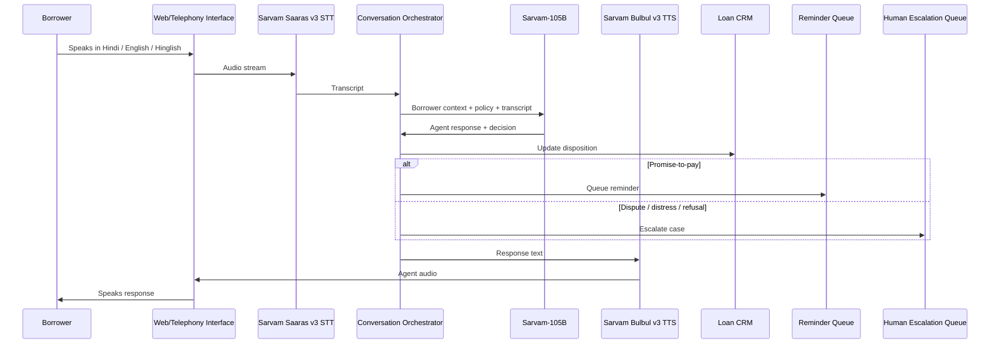

# Architecture Diagram

## Data Flow

1. Borrower speech enters web app or telephony layer.
2. Saaras v3 transcribes speech and handles code-mixing.
3. Orchestrator injects account details and collections policy.
4. Sarvam-105B generates compliant response and workflow decision.
5. Workflow layer updates CRM, reminder queue, and escalation queue.
6. Bulbul v3 generates voice output.
7. Post-call analytics summarizes outcome and risk.
